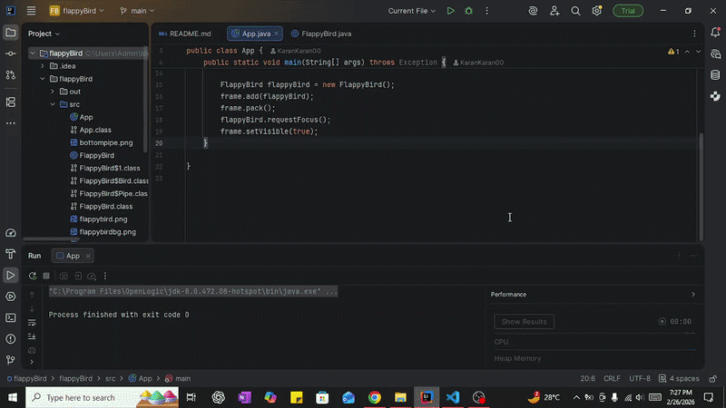

<h1 align="center">flappyBird</h1>

Flappy Bird Game using Java Language

---

  

  ---

  
  
  
  

---

Special thanks to <strong>Kenny Yip Coding</strong> for the clear and helpful explanation.

I learned a lot from that video, and this project would not have been possible without it.

<strong>Tutorial link:</strong> 
https://www.youtube.com/watch?v=Xw2MEG-FBsE&t=2343s

